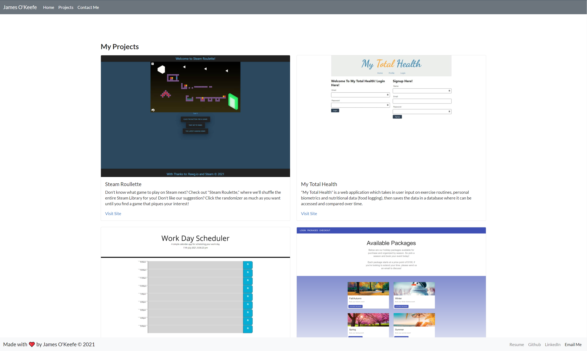

# React Portfolio

## Description:
The purpose of this assignment was to create a React portfolio to be able to share my projects while I'm applying for Jobs or working as a feelancer. It also gives me the ability to share my work with other developers and collavorate on projects.

## Built With:
- React
- React-Bootstrap
- Javascript
- JSX

## Screenshot:

## Links:
[GitHub]https://github.com/j-okeefe

[Portfolio]https://j-okeefe.github.io/react-portfolio/

[Email](mailto:jbo88@att.net)